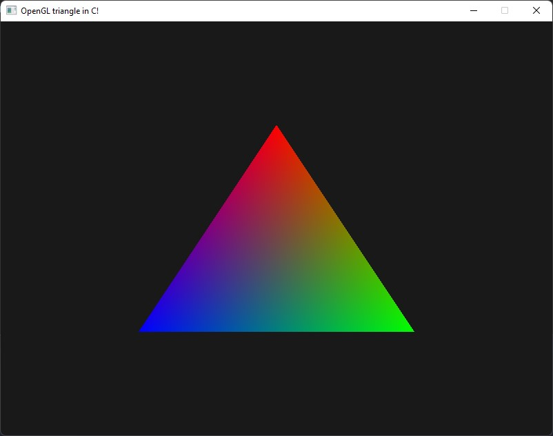

# OpenGL Triangle In C
An OpenGL triangle written in C. (most likely) Full of bad code and memory leaks!

I used vs/MSVC only becuase MinGW was acting up when I tried to read/write files using -O2. Idk why, so I did the lazy thing and swapped compilers. I still hate MSVC though.

